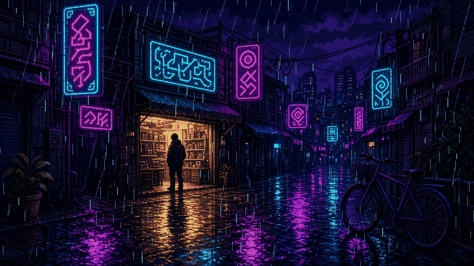

  

<h2 align="center">Abubakar Salar</h2>

  MERN Stack Developer · Web Designer · Freelancer
   
  Gujrat, Pakistan

  <code>[ npm start — another app nobody asked for. ]</code>

  
  

---

## About

I build full-stack web applications with the MERN stack: **MongoDB**, **Express**, **React**, and **Node.js**. I also ship dashboards and product sites with **Next.js** and **TypeScript**.

Most of the work is role-based systems, management portals, and responsive interfaces that people can actually use.

- Full-stack apps, from the interface through the API to the database
- Authentication, protected routes, and role-based access
- Responsive layouts for phones and desktops
- Deployments on Vercel

## Tech stack

**Frontend**

  
  
  
  
  
  
  
  

**Backend**

  
  
  
  

**Database**

  
  

**Tools**

  
  
  
  

## Featured projects

| Project | What it is | Stack |
| --- | --- | --- |
| [Task Master](https://github.com/Salar11111/TODO-MernStack) | Task app with auth, a dashboard, a calendar, and a Kanban board | MongoDB, Express, React, Node.js |
| [Harbor School](https://github.com/Salar11111/SMS-01-) | School system for admins, teachers, students, and parents | Next.js, TypeScript |
| [Meridian Health](https://github.com/Salar11111/HMS-01) | Multi-role hospital portal | Next.js, TypeScript, Prisma |
| [LabNex Practice](https://github.com/Salar11111/LabNex-Practice) | Lab workflow for patients, orders, samples, and results | Next.js, Prisma, Tailwind CSS |
| [Chronos Watches](https://github.com/Salar11111/Chronos-Watches) | Luxury watch landing page with tests and a tight bundle budget | Vite, TypeScript |

## GitHub

  
  

  

## Contact

- Email: [muhammadabubakarsalar@gmail.com](mailto:muhammadabubakarsalar@gmail.com)
- GitHub: [github.com/Salar11111](https://github.com/Salar11111)
- Location: Gujrat, Pakistan
- Open to freelance MERN and Next.js work
